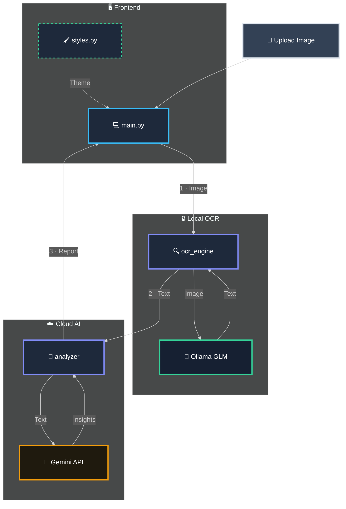

# 🏥 CuraVision

> **Medical Document Text Extraction, Processing, and Simplification**

[](https://python.org)
[](https://streamlit.io)
[](https://ollama.com)
[](https://ai.google.dev)

CuraVision is an intelligent medical assistant that transforms complex healthcare documents into clear, patient-friendly reports. It uses a **hybrid local + cloud pipeline**: raw medical images are processed **entirely on your machine** using local OCR, and only the **extracted text** (never the original image) is sent to Google Gemini for simplification.

---

## ✨ Key Features

| Feature                     | Description                                                                                                               |
| --------------------------- | ------------------------------------------------------------------------------------------------------------------------- |
| 🔒 **Local OCR**            | Image-to-text extraction runs entirely on your machine via Ollama — the original document image never leaves your device. |
| 🧠 **AI Simplification**    | Only the extracted text is sent to Google Gemini, which converts medical jargon into plain, reassuring language.          |
| 🔄 **Multi-Model Failover** | Automatic switching between 5 Gemini models ensures uninterrupted service availability.                                   |
| 📊 **Real-Time Streaming**  | Both OCR and analysis results stream live with a typewriter effect for instant feedback.                                  |
| 📄 **Export Reports**       | Download simplified analysis as a Markdown file for sharing with family or caregivers.                                    |
| 🎨 **Modern Dashboard**     | A responsive 3-column layout with gradient branding, hover animations, and glassmorphism.                                 |

---

## 🏗️ Architecture

The project follows a **modular engine architecture** where each component is independently developed, tested, and maintained:



| Module                   | Responsibility                                                                              |
| ------------------------ | ------------------------------------------------------------------------------------------- |
| **`main.py`**            | Entry point — wires up all engines into a 3-column Streamlit dashboard.                     |
| **`ocr_engine.py`**      | Runs GLM-OCR locally via Ollama for private, streaming text extraction.                     |
| **`analysis_engine.py`** | Sends the **extracted text only** to Gemini for medical simplification with failover logic. |
| **`styles.py`**          | Injects custom CSS for gradient branding, button animations, and responsive layout.         |

---

## 🛠️ Installation & Setup

### Prerequisites

- Python 3.9+
- [Ollama](https://ollama.com/) installed
- A Google Gemini API Key ([Get one here](https://ai.google.dev))

### Step 1: Install & Start Ollama

Download Ollama from [ollama.com](https://ollama.com/) and pull the OCR model:

```bash
ollama pull glm-ocr
```

**Platform-specific notes:**

| Platform    | Ollama Service Behavior                                                                                                                  |
| ----------- | ---------------------------------------------------------------------------------------------------------------------------------------- |
| **Linux**   | Ollama runs automatically as a `systemd` service after installation. No manual action needed.                                            |
| **Windows** | Ollama starts automatically in the system tray when you log in. Ensure the Ollama icon is visible in the tray before running CuraVision. |
| **macOS**   | Ollama runs as a menu bar app. Launch it from Applications if it's not already running.                                                  |

> **Troubleshooting:** If Ollama is not responding, you can manually start it by running `ollama serve` in a terminal.

### Step 2: Clone & Install

```bash
git clone https://github.com/SkandhHanda-Sk/CuraVision.git
cd CuraVision
pip install -r requirements.txt
```

### Step 3: Configure API Key

Create a `.env` file in the project root:

```env
GEMINI_API_KEY=your_api_key_here
```

### Step 4: Run the Application

**Option A — Using the shell script (Linux/macOS with virtual environment):**

```bash
./run.sh
```

> This activates the `.venv` virtual environment and launches Streamlit. You must have created a venv first with `python -m venv .venv && pip install -r requirements.txt`.

**Option B — Direct run (any OS, no virtual environment):**

```bash
streamlit run main.py
```

The app will open at **http://localhost:8501**.

---

## 📖 How It Works

1. **Upload** a medical document image (JPG, PNG, or JPEG).
2. **OCR Engine** extracts raw text locally using GLM-OCR.
3. **Analysis Engine** sends the extracted text to Gemini, which returns:
   - 📋 **Summary** — Plain English explanation.
   - ⚠️ **Key Findings** — Abnormal values with reassuring context.
   - 💡 **Suggestions** — 3-4 lifestyle recommendations.
4. **Download** the report as a Markdown file.

---

## 📸 Sample Inputs

The `samples/` folder contains test documents covering the three major medical document formats:

| Sample | Type | Description |
| ------ | ---- | ----------- |
| `digital.jpeg` | Digital Lab Report | A Kidney Function Test (KFT) report with structured tabular data |
| `handwritten.jpg` | Handwritten Prescription | A doctor's handwritten prescription from Sir Ganga Ram Hospital |
| `scanned.png` | Scanned Lab Report | A Liver Function Test report scanned from a physical printout |

> **Try it yourself:** Upload any of these images into CuraVision to see the full OCR → Analysis pipeline in action.

---

## 🐞 Debugging Tasks

The following engineering challenges were identified and resolved during development:

### 1. Monolithic to Modular Architecture

- **Problem:** The original codebase was a single `backend.py` file containing OCR, analysis, and configuration logic — making parallel development and testing difficult.
- **Solution:** Decomposed into three independent engines (`ocr_engine.py`, `analysis_engine.py`, `styles.py`), each with a single responsibility.

### 2. Hardcoded API Credentials

- **Problem:** The Gemini API key was embedded directly in source code, posing a security risk on public repositories.
- **Solution:** Implemented `python-dotenv` to load credentials from a `.env` file, which is excluded from version control via `.gitignore`.

### 3. Single-Model Dependency

- **Problem:** The application relied on a single Gemini model. If that model was rate-limited or unavailable, the entire analysis pipeline would fail silently.
- **Solution:** Implemented a priority-based failover loop across 5 Gemini model variants, with clear user-facing error messages when all models are exhausted.


---

## 👨‍💻 Team CogniCare

| Member            | Role               | Key Contribution                                                |
| ----------------- | ------------------ | --------------------------------------------------------------- |
| **Yash**          | DevOps Lead        | Project setup, environment configuration, and execution scripts |
| **Skandh Handa**  | Vision Engineer    | Local OCR engine implementation using Ollama                    |
| **Vedansh Tyagi** | AI Engineer        | Gemini integration and prompt engineering                       |
| **Shubhankar**    | Systems Integrator | Main application logic and engine orchestration                 |
| **Vinayak Gupta** | UI/UX Architect    | Design system, custom CSS, and visual identity                  |
